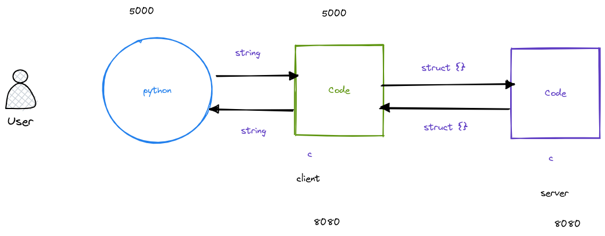
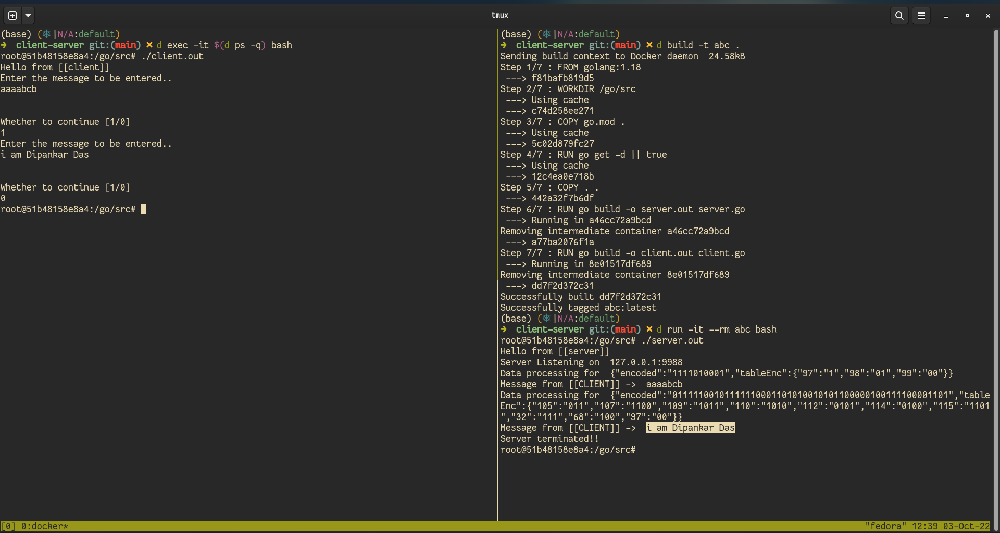

# Efficient-client-server

## Architecture


## Running complete Backend


## How to run

```bash
cd src/client-server
docker build -t abc .

# server
docker run --rm -it abc bash
./server.out

# client
docker exec -it $(docker ps -q) bash
./client.out

```
